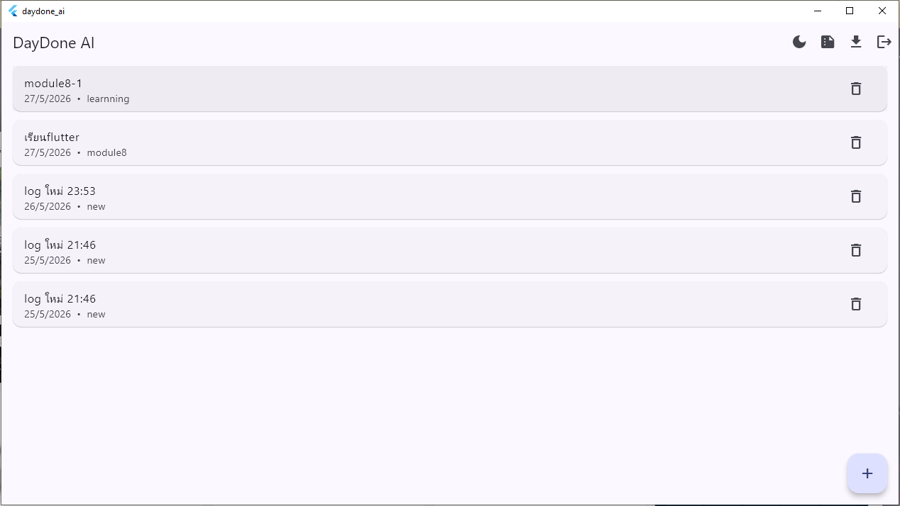
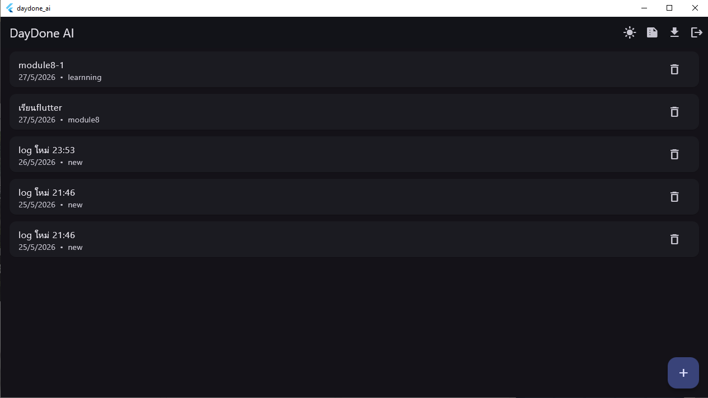

# DayDone AI 📋

แอป Work Log + AI Summary สำหรับบันทึกและสรุปงานประจำวัน

## Screenshots

| Light Mode | Dark Mode |
|---|---|
|  |  |

## Features

- 📝 บันทึก/แก้ไข Work Log แบบ free-text
- 🤖 AI สรุปงาน weekly/monthly (Claude + Gemini สลับได้)
- 📊 Export Excel แบบ dynamic เลือก column เองได้
- 💾 Offline cache ด้วย SQLite
- 🌙 Dark / Light mode (จำค่าได้หลัง restart)
- 🔐 Auth system (Mock → Firebase ready)

## Tech Stack

| Layer | Tech |
|---|---|
| State Management | Riverpod AsyncNotifier |
| Architecture | Clean Architecture 3 ชั้น |
| Local DB | SQLite (sqflite) |
| HTTP Client | Dio + Retry interceptor |
| AI Integration | Claude API + Gemini API |
| Export | excel package + share_plus |
| Auth | GoRouter + MockAuth |
| Theme | SharedPreferences persist |
